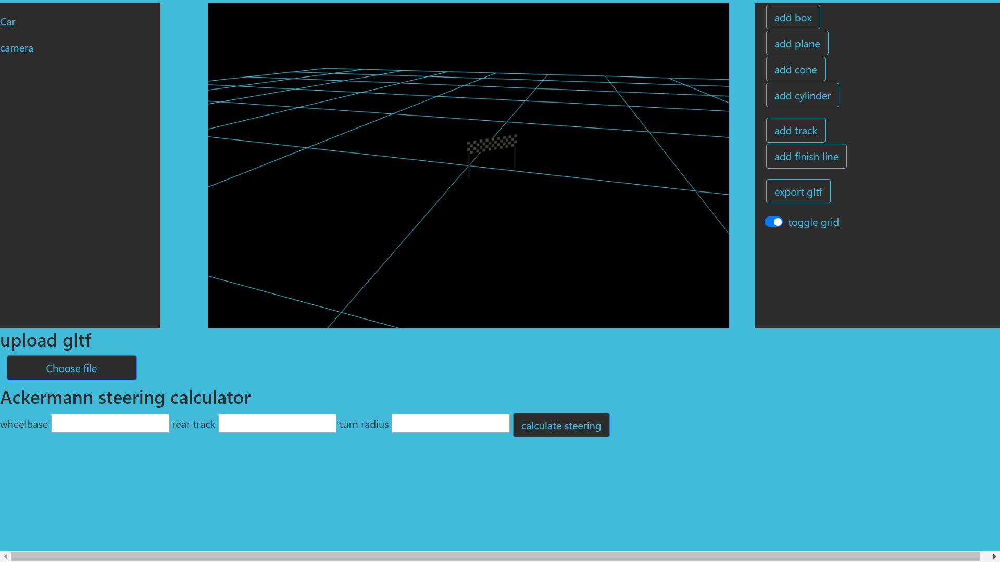

# rgnjs
 A racing game library starter and editor based on Three.js, ported from a C# project.



## Overview

rgnjs is a JavaScript library and editor designed for creating racing games using Three.js.  
It provides essential game components and a simple editor interface to help build and customize racing game environments.  
This project is an early-stage port from a C# racing game engine.

## Features

- Core racing game components in JavaScript  
- Editor interface for track and game customization  
- Built on Three.js for 3D rendering  
- Modular and extensible architecture

## Getting Started

### Prerequisites

- Node.js and npm installed on your system

### Installation

```bash
git clone https://github.com/grzesiekmq/rgnjs.git
cd rgnjs
npm install
```

### Running the Project

npm start

Then open your browser at http://localhost:8080 to see the project in action.

## Project Structure

rgnjs/
├── assets/           # Game assets like images and textures
├── css/              # Stylesheets
├── docs/             # Documentation files
├── js/               # JavaScript source code
├── templates/        # HTML templates
├── index.html        # Main HTML file
├── package.json      # Node.js dependencies and scripts
├── webpack.config.js # Webpack configuration
├── .babelrc          # Babel configuration
├── LICENSE           # License file
└── README.md         # This file

## License

MIT License


---

README assisted by ChatGPT.

# Donation
If you like this project you can 'star' the repo or/and give me a beer as a thank you :)

[](https://paypal.me/Griszamq
)
